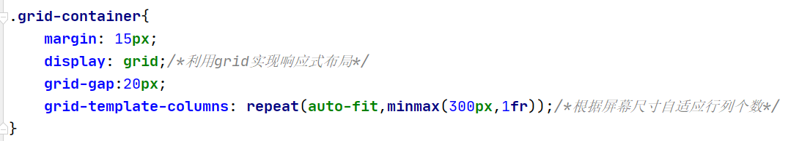
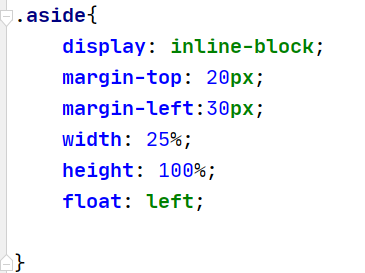
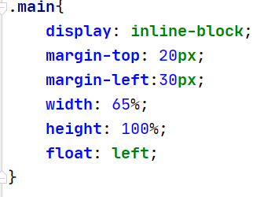

#这是我的PJ1文档
姓名：张明
学号：18300200008

-------------------------

Github地址：https://github.com/zanyingluan/PJ1.git
Github page地址：https://zanyingluan.github.io/PJ1/.

--------------------------
#1.项目完成情况
	Grade.pdf上所有的功能都成功实现
	html与css文档都标记了注释 按照布局分别进行样式的修改 逻辑很清晰 可以根据注释快速找到对应部分

#2.Bonus完成情况与解决方法
2.1图片裁剪

	完成情况：本PJ所有的图片均采用normal文件夹内的图片

	解决方法：将所有图片都设置为了div的background-img，利用其cover/contain的性质完成图片对容器的自适应

具体代码如图:

2.2响应式布局 
	完成情况：具体实现在本PJ的主页与浏览页的图片展示部分

	解决方法：在这两个页面的图片展示区域采用了Grid布局，根据屏幕窗口的比例控制行列的关系，达到近似响应式布局的效果
			 其中Broser界面采取浮动布局，即屏幕过小可以让右边的filter界面下浮到侧边栏下部

具体代码如图：

具体效果如图：

		
	
2.3界面美观：比较美观

	完成情况：采用了个人很喜欢的极简主义的风格 突出网页重点功能区域
	解决方法：只在主要部分显示边框 部分与部分用虚线
分割 不同功能区间隔比例良好
			 按钮都使用了icon图标代替 还在My favourite和My Photo界面尝试设置图标浮动文字
			 margin的间隔与height-width等多用百分比，字体采用em单位，较好适应不同设备的需求

#3.对PJ1和本门课程的意见和建议
我希望能看到每次lab的成绩反馈，同时希望每周的lab能和pj有所联系，更好地帮助我们学习前端的知识。
	
