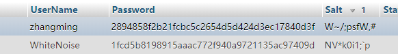

#这是我的PJ2文档
姓名：张明
学号：18300200008

-------------------------

Github地址：https://github.com/zanyingluan/PJ2.git
--------------------------
#1.项目完成情况
	Grade.pdf上所有的功能都成功实现

#2.Bonus完成情况与解决方法
1哈希加盐
	完成情况：本网站所有注册的用户的密码都经过了哈希加盐

2服务器部署
	完成情况：直接进入域名 http://xiaokonglong727.xyz:55555/

#3.对PJ2和本门课程的意见和建议
	学到了很多东西很多东西！希望给分也能好一些~

	
